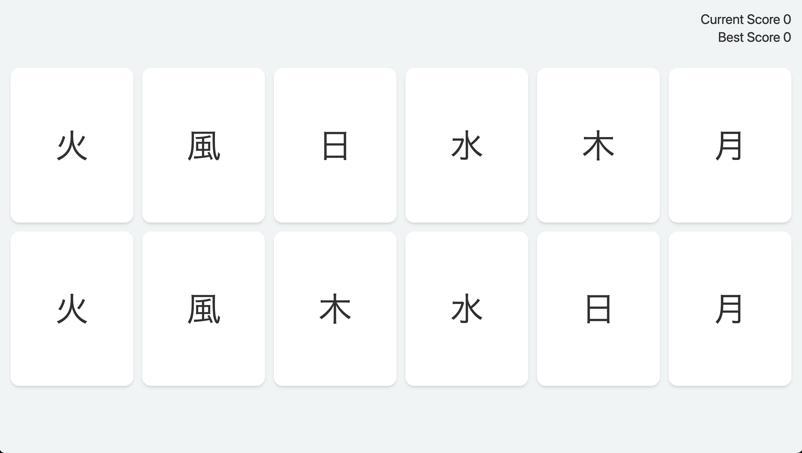

# Memory Card

A simple game to test your memory

## About

This is based on The Odin Project [Memory Card](https://www.theodinproject.com/lessons/javascript-memory-card). My goal was to learn about [Vue Lifecycle Hooks](https://vuejs.org/guide/essentials/lifecycle.html) to shuffle the game card components before they are mounted. It's a simple use of the `mounted` method but I can see how hooking into different parts of a component's lifecycle can be useful for specific cases. Overall, this was a quick, easy, and fun vue project. Styled and responsive with Tailwind CSS.

## How to play

- Click on a unique card each round to stack up your points.

- The score will be reset if you click on a card you've already selected

- The best score you can get is 6
